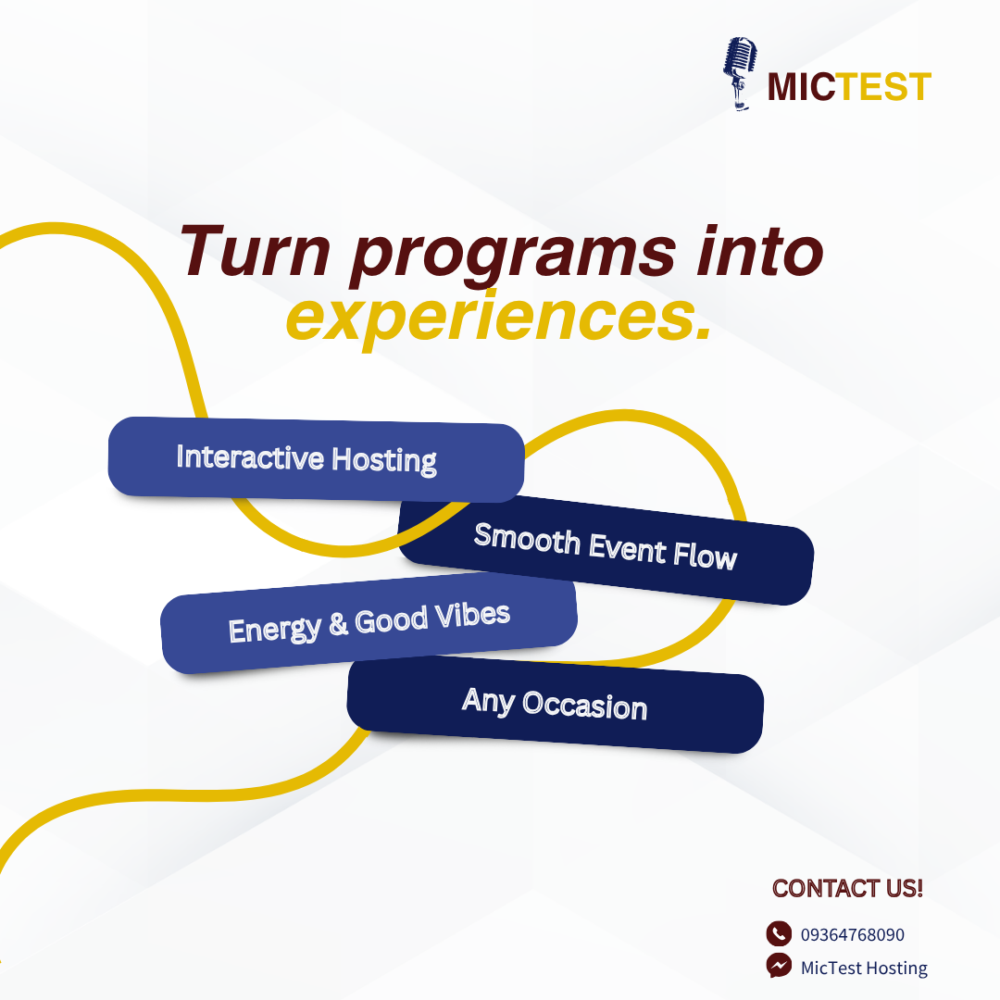
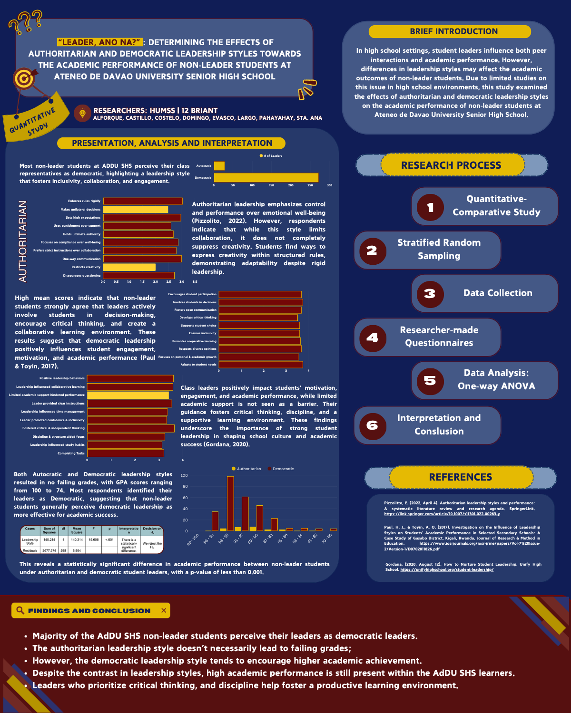

# ALYN FAITH T. ALFORQUE
#### GROW THROUGH WHAT YOU GO THROUGH

## ❤️ About Me
Hi! I'm Faith, an aspiring CPA-Lawyer and student leader passionate about communication, creativity, and continuous growth. My work reflects my interests in hosting, public speaking, leadership, and visual design, allowing me to connect with people and communicate ideas effectively.

This portfolio showcases projects that demonstrate my ability to combine creativity with organization and purpose. Guided by my tagline, I approach every challenge as an opportunity to learn, improve, and make a meaningful impact.

## ✍️ Skills & Interests
- Speaking/Hosting
- Problem-Solving
- Leadership Roles

## 🗃️ Projects
#### **Professional Banner**
 
> This banner was designed to present my professional profile in a clear and visually appealing manner. I used a consistent color palette of red, blue, yellow, and light blue to create a balance between professionalism, confidence, and approachability. The layout highlights my personal information and contact details, making it easy for viewers to learn more about me.

#### **Promotional Post**
 
> This promotional material was created to advertise my hosting and emceeing services while maintaining a strong and consistent brand identity. I applied the same color palette used in my professional banner to reinforce brand recognition and visual consistency. The design emphasizes key information and uses engaging visuals to attract potential clients.

#### **Information Graphic**
 
> This infographic was designed to present information in a clear, organized, and visually engaging format. I used visual hierarchy, icons, and a consistent color scheme to simplify complex ideas and make the content easier to understand. The layout was carefully structured to guide viewers through the information while maintaining readability and visual appeal.

## 👋 That's All!
This portfolio represents my growth as a student, leader, and aspiring professional. Each project reflects the skills and values I continue to develop, including creativity, communication, and perseverance. As I move closer to my goals, I remain committed to learning, improving, and growing through every experience.

--

### The Davao Waste Management Prompt System

#### 1. System Prompt Template (V3 - Final Optimized)

"Act as a Senior Environmental Management Advisor specializing in urban waste management in Davao City. Your objective is to draft a 300-word community action brief for barangay officials and local residents.

Context: Several barangays in Davao City are experiencing challenges with improper waste segregation, illegal dumping, and low participation in recycling initiatives.

Constraints: Use a professional, community-centered tone. Do NOT mention waste management systems from other countries; focus entirely on local barangay programs, waste collection practices, and community participation. Do not use technical environmental jargon.

Format: Output in clear Markdown with exactly three actionable steps under the heading '### Community Waste Solutions'."

#### 2. Prompt Battle Ledger

| Version | Prompt Modifier Added | Output Quality Reflection |
| :--- | :--- | :--- |
| V1 | "Write a waste management plan for Davao City." | Too broad. Mentioned generic environmental practices that were not specific to Davao City's communities. |
| V2 | Added environmental advisor persona and barangay context. | Better, but the language became too technical and lacked practical guidance for residents. |
| V3 | Added a 300-word limit and explicit local community constraints. | Target hit. Clear, actionable, and highly localized to Davao City's waste management challenges. |

#### 3. Visual Branding Asset

- **Engine Used:** Canva Magic Media / DALL-E 3

- **Visual Prompt:** "A flat minimalist vector logo of a recycling symbol intertwined with a green leaf and a simplified Davao City skyline. Use a clean blue and green color palette. No gradients, shadows, text, or 3D effects. Government-friendly design with simple geometric shapes and a transparent background.
